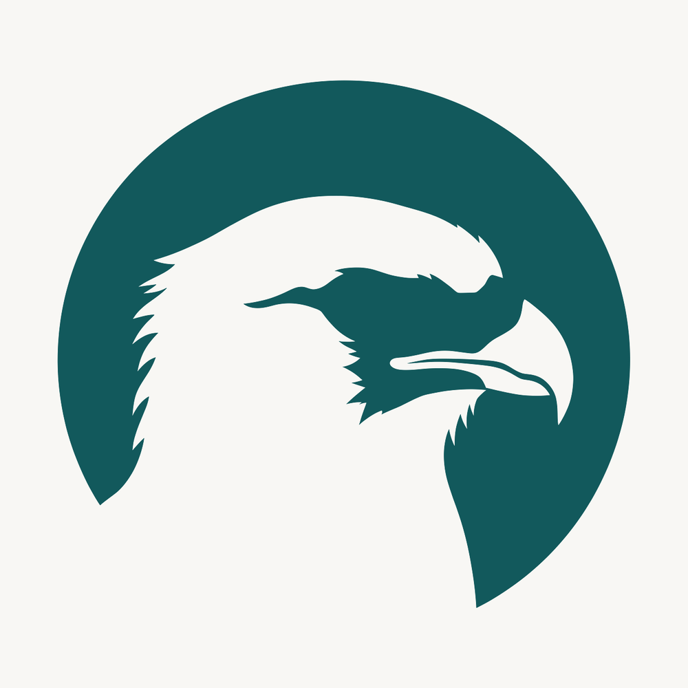

# Brand

The ChimangoScan mark is a solid circle with the head of a chimango, a caracara of the Pampa,
cut out of it in negative. The circle reads as a lens, which is what the organization does to
Docker Hub. It follows the same construction as the mark of
[BagualOps](https://github.com/BagualOps): one shape, one cutout, two colors.

    
  

| File | Size | Use |
|---|---|---|
| `chimangoscan-logo-alpha.png` | 2400 x 768 | Horizontal lockup on a transparent background. This is the one to use in READMEs and on the web. |
| `chimangoscan-logo.png` | 2400 x 768 | The same lockup on the off-white ground, for print and for anywhere transparency is not wanted. |
| `chimangoscan-avatar.png` | 1000 x 1000 | The circle alone, centered on a square. Use it as the organization avatar, and anywhere the name would be too small to read. |
| `chimangoscan-logo-source.jpeg` | 3584 x 1184 | The source image everything else is derived from. |
| `chimangoscan-social-preview.png` | 1280 x 640 | The repository social preview, the image GitHub shows when a link is shared. The Docker logo in it is the official asset from docker.com, unmodified, used to name what is being measured. |
| `prompt-logo-chimangoscan.txt` | | The prompt that produced the source image. |

Colors, and no third one:

| | Hex | Where |
|---|---|---|
| Ink | `#12595C` | The circle and the name |
| Ground | `#F8F7F4` | The background, and therefore the bird cut out of the circle |

The ground is the same warm off-white BagualOps and AdminForge use, on purpose: it is what
keeps the marks in one family while the color tells them apart. Both derived files carry these
exact values, snapped from what the generator returned.

The avatar keeps the ground rather than transparency, because GitHub crops avatars to a square
and fills whatever is transparent according to the viewer's theme.

Do not recolor the mark, stretch the lockup, put a letter inside the circle, or set the name in
a substitute typeface.
